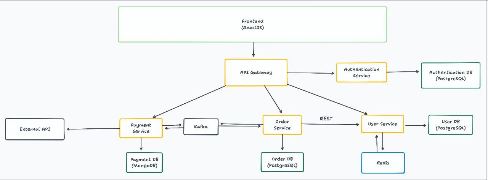

# inno-microservices

A modular microservices-based application built with Java 21 and Spring Boot 3.5.7, following modern 
development practices including containerization, CI/CD and comprehensive testing.

## technology stack

- **Language:** Java 21
- **Frameworks:** Spring Boot 3.5.7, Spring Cloud 4.3.0
- **Build Tool:** Maven
- **Containerization:** Docker, Docker Compose
- **CI/CD:** GitHub Actions, Kubernetes
- **Testing:** JUnit 5, Mockito, Testcontainers, WireMock
- **Databases:** PostgreSQL, MongoDB, Redis
- **Message Broker:** Apache Kafka

## development strategy

- all microservices share the same repository
- `main` branch is protected and contains production-ready code
- all development happens through pull requests (PR)
- each microservice is a standalone Spring Boot application with its own `pom.xml`, developed in a separate 
directory using its own branch
- root-level `pom.xml` defines shared dependency versions and common plugins

## microservices

### architecture diagram



### user-service

**Location:** `/user-service/`  
**Port:** 8081  
**Description:** User profile management service handling user data and payment cards information.

**Features:**
- user profile management (CRUD operations except user creation)
- payment card management
- user creation (`POST /api/users`) is designed to be called internally by auth-service only during 
registration

**Technical implementation:**
- **Database:** PostgreSQL with Liquibase migrations
- **Caching:** Redis for user and card data

### auth-service

**Location:** `/auth-service/`  
**Port:** 8082  
**Description:** Central authentication and authorization service handling user registration, login and
JWT token management.

**Features:**
- user registration with phone number validation
- login/password authentication with BCrypt hashing
- JWT token generation, validation and refresh using `security-starter`
- integration with `user-service` via Feign Client

**Technical implementation:**
- **Database:** PostgreSQL with Liquibase migrations
- **Security:** Spring Security, JWT, BCryptPasswordEncoder
- **Communication:** synchronous HTTP communication
- **Registration flow:** `auth-service` → Feign Client → `user-service`

### order-service

**Location:** `/order-service/`  
**Port:** 8083  
**Description:** Order processing service handling order lifecycle, inventory validation, and payment
coordination.

**Features:**
- full order lifecycle management (create, update, cancel/delete)
- integration with `user-service` for customer data
- integration with `payment-service` for payment attempts
- order status tracking

**Technical implementation:**
- **Database:** PostgreSQL with Liquibase migrations
- **Communication:** synchronous HTTP communication, asynchronous communication via message broker
- **Architecture pattern:** event-driven microservices with eventual consistency, circuit breaker for 
the fault tolerance
- **Message broker:** Apache Kafka
- **Circuit breaker:** Resilience4j

### api-gateway

**Location:** `/api-gateway/`  
**Port:** 8080  
**Description:** Centralized API gateway serving as single entrypoint for all client requests.

**Features:**
- request routing to appropriate microservices
- JWT-based security filtering and validation using `security-starter`

**Technical implementation:**
- **API Gateway implementation:** Spring Cloud Gateway with WebFlux (non-blocking)
- **Security:** Spring Security, JWT
- **Routing:** Static route configuration to fixed service ports

**Key routes:**
- `api/v1/users/**` -> routes to `user-service:8081`
- `api/v1/auth/**` -> routes to `auth-service:8082`
- `api/v1/orders/**` -> routes to `order-service:8083`

### payment-service

**Location:** `/payment-service/`  
**Port:** 8085  
**Description:** Payment processing service with asynchronous event-driven architecture.

**Features:**
- payment processing and transaction management
- integration with external API to simulate payment attempts
- integration with `order-service` for payment results
- payment status tracking

**Technical implementation:**
- **Database:** MongoDB (set of three replicas) with Liquibase migrations
- **Communication:** synchronous HTTP communication, asynchronous communication via message broker
- **Message broker:** Apache Kafka
- **External API integration:** [external random number API](https://www.randomnumberapi.com/)

### config-server

**Location:** `/config-server/`  
**Port:** 8888  
**Description:** Centralized configuration management service using Spring Cloud Config.

**Features:**
- externalized configuration for all microservices
- native-backed configuration storage

## shared libraries

### security-starter (additional task)

**Location:** `/security-starter/`  
**Description:** Shared Spring Boot Starter for centralized JTW authentication and authorization.
Eliminates code duplication for token parsing and validation across all microservices.

**Features:**
- automatic JWT parser configuration
- ready-to-use filters for token generation and validation
- methods for retrieving user ID and other claims from token

## deployment

### prerequisites

- **Docker** and **Docker compose** (must be running for tests and deployment)
- **Minikube** and **kubectl** (for production-like deployment)
- **Java 21+** and **Maven 3.8+** (for building from source)

### getting started

```bash
# ensure Docker is running
docker --version
docker-compose --version

# enter the project package
cd inno-microservices

# build all microservices (requires Docker for Testcontainers)
mvn clean install # or alternatively using an IDE
```

### option 1: docker compose (development)

```bash
# start all services and infrastructure
docker-compose up --build -d

# access url: http://localhost:8080/api/v1/

# stop services
docker-compose down
```

### option 2: kubernetes (production-like)

```bash
# build all services and infrastructure
docker-compose build

# start minikube with sufficient resources
minikube start --memory=7700 --cpus=4 --driver=docker

# enable ingress addon
minikube addons enable ingress

# make deploy/cleanup scripts executable (using Linux or WSL2 or Git bash terminal)
cd k8s-manifests
chmod +x deploy.sh
chmod +x cleanup.sh
cd ..

# start all services and infrastructure with deploy script (using Linux or WSL2 or Git bash terminal)
k8s-manifests/deploy.sh # or alternatively run kubectl commands from the script manually one-by-one

# open minikube dashboard in a browser (in a separate terminal)
minikube dashboard

# open minikube tunnel (in a separate terminal)
minikube tunnel

# get dynamically assigned port
minikube service ingress-nginx-controller -n ingress-nginx --url
# example: http://127.0.0.1:60497

# access url: http://127.0.0.1:60497/api/v1

# stop all services and infrastructure with cleanup script (using Linux or WSL2 or Git bash terminal)
k8s-manifests/cleanup.sh # or alternatively run kubectl commands from the script manually one-by-one

# stop minikube tunnel (Ctrl+C in the tunnel terminal)
# stop minikube cluster
minikube stop

# or delete the cluster completely
minikube delete

# stop services
docker-compose down
```