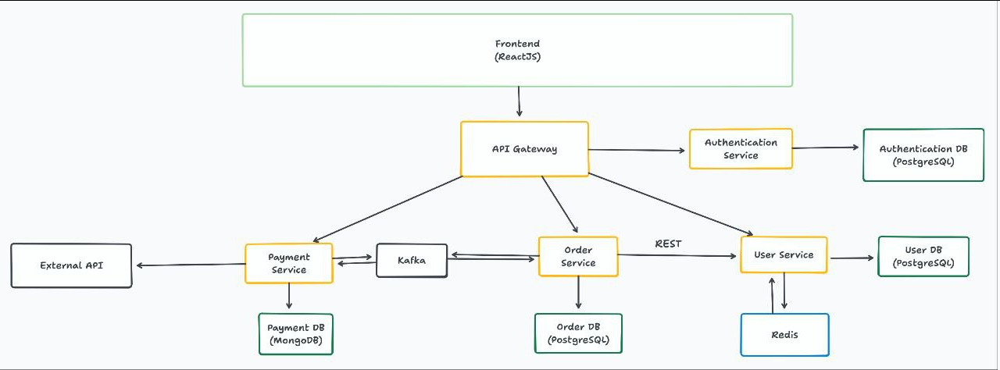

# inno-microservices

A modular microservices-based application built with Java 21 and Spring Boot 3.5.7, following modern development 
practices including containerization, CI/CD and comprehensive testing.

## technology stack

- **Language:** Java 21
- **Frameworks:** Spring Boot 3.5.7, Spring Cloud 4.3.0
- **Build Tool:** Maven
- **Containerization:** Docker, Docker Compose
- **CI/CD:** GitHub Actions, Kubernetes
- **Testing:** JUnit 5, Mockito, Testcontainers, WireMock

## development strategy

- all microservices share the same repository
- `main` branch is protected and contains production-ready code
- all development happens through pull requests (PR)
- each microservice is a standalone Spring Boot application with its own `pom.xml`, developed in a separate directory 
using its own branch
- root-level `pom.xml` defines shared dependency versions and common plugins

## microservices

### architecture diagram

### user-service

**Location:** `/user-service/`  
**Port:** 8081  
**Description:** User profile management service handling user data and payment cards information.

**Features:**
- user profile management (CRUD operations except user creation)
- payment card management
- user creation (`POST /api/users`) is designed to be called internally by auth-service only during registration

**Technical implementation:**
- **Database:** PostgreSQL with Liquibase migrations
- **Caching:** Redis for user and card data

### auth-service

**Location:** `/auth-service/`  
**Port:** 8082  
**Description:** Central authentication and authorization service handling user registration, login and
JWT token management.

**Features:**
- user registration with phone number validation
- login/password authentication with BCrypt hashing
- JWT token generation, validation and refresh using `security-starter`
- integration with `user-service` via Feign Client

**Technical implementation:**
- **Database:** PostgreSQL with Liquibase migrations
- **Security:** Spring Security, JWT, BCryptPasswordEncoder
- **Communication:** synchronous HTTP communication
- **Registration flow:** `auth-service` → Feign Client → `user-service`

### order-service

**Location:** `/order-service/`  
**Port:** 8083  
**Description:** Order processing service handling order lifecycle, inventory validation, and payment
coordination.

**Features:**
- full order lifecycle management (create, update, cancel/delete)
- integration with `user-service` for customer data
- integration with `payment-service` for payment attempts result
- order status tracking

**Technical implementation:**
- **Database:** PostgreSQL with Liquibase migrations
- **Communication:** synchronous HTTP communication, asynchronous communication via message broker
- **Message broker:** Apache Kafka
- **Architecture Pattern:** Event-driven microservices with eventual consistency

### payment-service

**Location:** `/payment-service/`  
**Port:** 8085  
**Description:**

### config-server

**Location:** `/config-server/`  
**Port:** 8888  
**Description:** Centralized configuration management service using Spring Cloud Config.

**Features:**
- externalized configuration for all microservices
- native-backed configuration storage

## shared libraries

### security-starter (additional task)

**Location:** `/security-starter/`  
**Description:** Shared Spring Boot Starter for centralized JTW authentication and authorization.
Eliminates code duplication for token parsing and validation across all microservices.

**Features:**
- automatic JWT parser configuration
- ready-to-use filters for token generation and validation
- methods for retrieving user ID and other claims from token